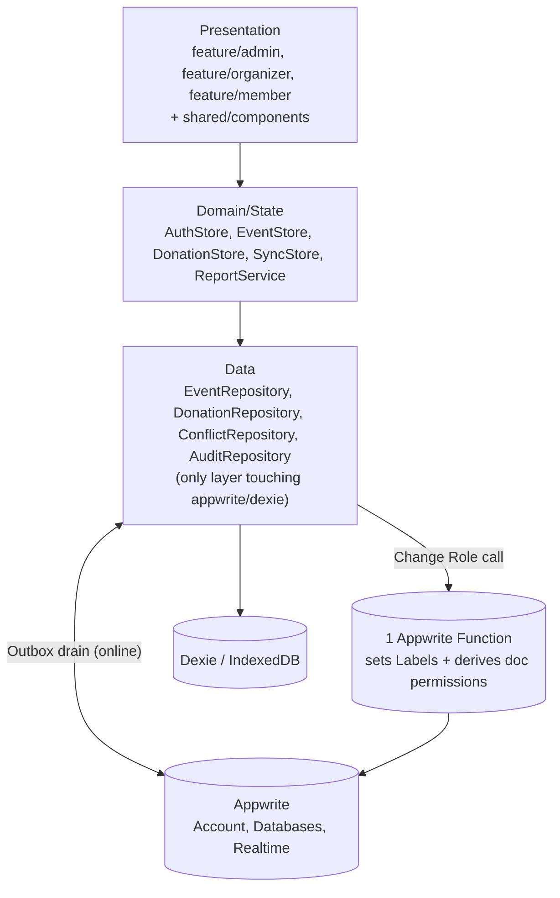
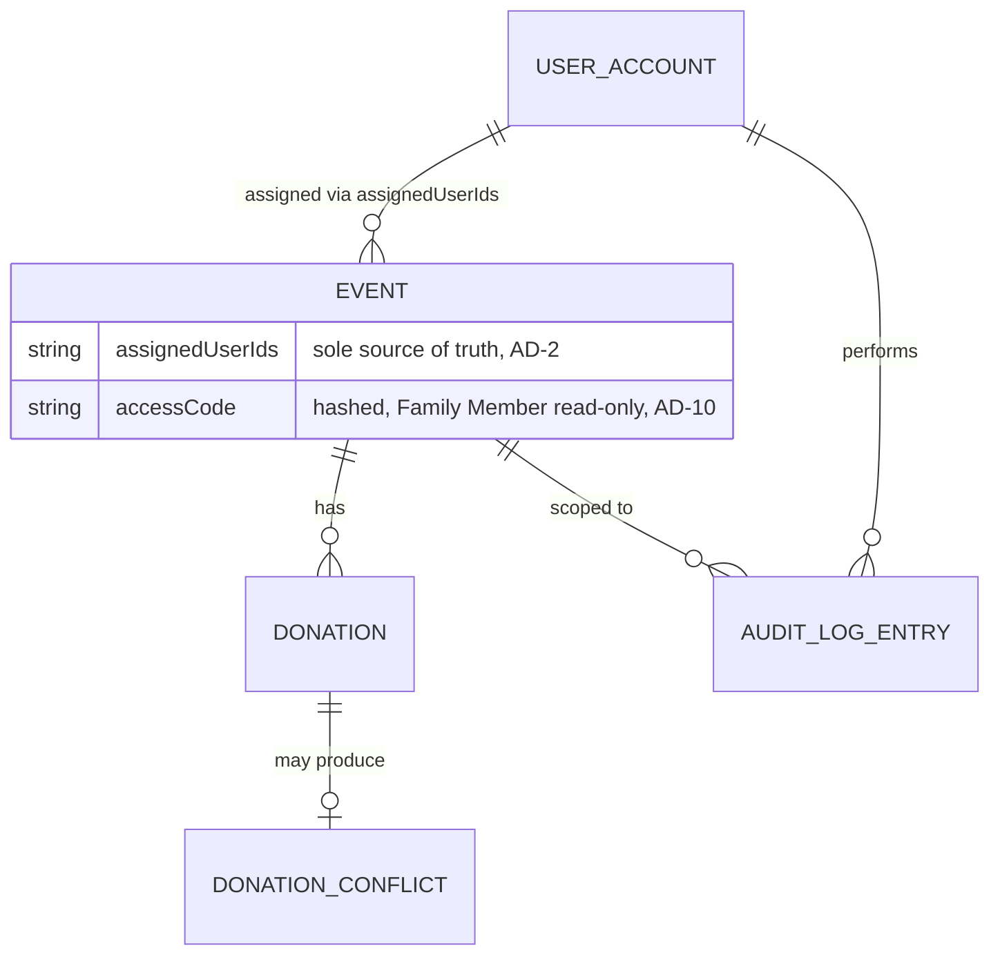

# Architecture Spine — Givio Donation Management System

## Design Paradigm

**Layered architecture** with three layers, an **offline-first Outbox** at the sync boundary, and **permissions mechanically derived from data** (never hand-edited in a second place):

1. **Presentation** — `feature/{admin,organizer,member}` page trees (1:1 with the screen specs in `.claude/skills/plan/`) + `shared/components` UI library.
2. **Domain/State** — signal-based stores (`AuthStore`, `EventStore`, `DonationStore`, `SyncStore`) and services (`ReportService`). Root-provided, no NgRx.
3. **Data** — one repository per aggregate (`EventRepository`, `DonationRepository`, `ConflictRepository`, `AuditRepository`), each the *only* code allowed to import `appwrite` or `dexie`. Each repository writes Dexie first and queues an **Outbox** entry for remote sync.



- **Rule:** dependencies flow strictly downward. Presentation never imports `appwrite`/`dexie`; Domain/State never imports them either — both go through Data repositories. The one Appwrite Function is invoked only from `data/repositories`, never from Presentation directly.

## Invariants & Rules

### AD-1 — Global role via Appwrite Labels, not prefs

- **Binds:** auth, all permission rules, `AuthStore`
- **Prevents:** the current `login.ts` pattern (`account.prefs.role`) lets any signed-in user self-escalate via `account.updatePrefs`, since prefs are client-writable. Labels are server/Console-only (verified against current Appwrite docs).
- **Rule:** the single source of truth for Admin/Operator role is an Appwrite **Label** on the user account. `AuthStore` reads `account.labels`. Appwrite permission rules needing a global (not event-scoped) check use `Role.label('admin')`. `IUserPrefs.role` is removed. (Family Members don't hold accounts at all — see AD-2.)

### AD-2 — Event-scoped access derived from `assignedUserIds` + `accessCode` (PRD's own data model, not Teams)

- **Binds:** Events, Donations, DonationConflicts
- **Prevents:** (a) an operator/family member reading or writing an event they aren't assigned to, even via direct API call (FR-SEC-002); (b) two sources of truth for "who's assigned" — an earlier draft of this spine used Appwrite Teams alongside the PRD's own `assignedUserIds:String[]` field, which would have let one story update Team membership and another update `assignedUserIds` and silently disagree.
- **Rule:** `Event.assignedUserIds` (PRD §9.1) is the *sole* source of truth for operator assignment. Appwrite document permissions on that Event and all of its Donations are a **mechanically derived projection** — `[Role.user(uid) for uid in assignedUserIds] + Role.label('admin')` — recomputed every time `assignedUserIds` changes (via the same Appwrite Function as AD-9, since bulk permission rewrites need elevated trust). No code path ever edits document permissions directly; they are only ever regenerated from `assignedUserIds`. Family Member read-only access is derived the same way from `Event.accessCode` (PRD §9.1, hashed) per AD-10, not from team membership. Admin's cross-event visibility falls out for free: `Role.label('admin')` is always included regardless of assignment.

### AD-3 — Conflict detection compares `$updatedAt`; conflicts resolved server-side only, Admin-only

- **Binds:** `SyncEngine`, `DonationRepository`
- **Prevents:** two builders inventing different "what counts as a conflict" logic, and a second offline conflict-review UI for a scenario PRD scopes as Admin-only online (PRD §10.2: "Conflict Resolution — Admin only").
- **Rule:** per PRD §8.3 exactly — every outbox *update* entry carries `baseUpdatedAt` (the server `$updatedAt` seen when the local edit began). On push, if the server document's current `$updatedAt` no longer matches `baseUpdatedAt`, it's a conflict: the incoming version is written to a `DonationConflicts` collection (`Role.label('admin')` only, references both versions), the server document is left untouched, and the local record's `syncStatus` is set to `'conflict'` (reusing the enum PRD §9.1 already defines). The shared `sync-status` screen's conflict-resolution section renders only when `Role.label('admin')` is present; other viewers of that screen see pending/synced counts only, never conflict diffs.

### AD-4 — Offline writes go through a per-entity Dexie Outbox with client-generated IDs

- **Binds:** `DonationRepository`, `EventRepository`, `SyncEngine`
- **Prevents:** divergent "when do we talk to Appwrite" logic per screen; duplicate documents from retried creates; one slow/stuck entity blocking every other entity's sync.
- **Rule:** every mutation writes to its local Dexie table **and** appends an outbox entry: `{ id, entityType: 'event'|'donation', entityId, op: 'create'|'update'|'delete', payload, baseUpdatedAt (update ops only), status: 'pending'|'synced'|'conflict'|'failed', retries, createdAt }`. `entityId` for a `create` is generated client-side via `ID.unique()` at the moment of creation (no network needed), so retrying a `create` is an idempotent upsert-by-id, never a duplicate. `SyncEngine` (root service) drains the outbox **per-entity FIFO** — each entity's own mutations apply in order, but entity A's queue never blocks entity B's. Donation entry/edit/receipt generation must work fully offline (FR-OFF-002).

### AD-5 — Money is integer minor units

- **Binds:** Donation entity, reporting/export
- **Prevents:** float rounding drift between displayed and stored totals.
- **Rule:** amounts are stored and transmitted as integer pesewas (GHS × 100), never floats. Display formatting divides by 100 at the presentation edge only. (PRD §9.1 lists `amount: Number` without specifying units — this pins it.)

### AD-6 — Route guards are functional and assignment-scoped

- **Binds:** `app.routes.ts` and every lazy-loaded child route config
- **Prevents:** the current state — zero guards; role redirect happens only imperatively inside `login.ts`, so any authenticated user can navigate directly to `/admin-dashboard`; PRD acceptance criterion #16 ("unassigned operator denied even via direct URL") is currently unmet.
- **Rule:** `CanActivateFn` guards check `AuthStore`'s label-derived role for role-gated routes, and additionally check the target event's `assignedUserIds` (or valid `accessCode` session, for Family Members) against the caller for event-scoped routes — the same data AD-2's permissions are derived from, so the guard and the Appwrite-level enforcement can never disagree.

### AD-7 — Feature routes are lazy-loaded

- **Binds:** `app.routes.ts`
- **Prevents:** the current flat, fully-eager route table from growing to 26+ eager components.
- **Rule:** each role tree (`admin`, `organizer`, `member`) is a `loadChildren`/`loadComponent` boundary. (Already a standing house rule in `.instructions.md` — applying it here, not re-deciding it.)

### AD-8 — Receipt numbers are provisional-then-final

- **Binds:** Donation entity, receipt PDF generation, reporting/export
- **Prevents:** two concurrently-offline operators on the same event colliding on PRD's required "auto-generated sequential per event" receipt number (FR §9.1) — no client can safely claim a true sequential number without a network round-trip.
- **Rule:** offline, the client assigns a provisional local number (event short code + "-P" + a local sequence number, e.g. `WED42-P7`), shown on the printed/PDF receipt with a small "provisional" marker. On successful sync, the server assigns the canonical number via an atomic `nextReceiptSeq` counter field on the Event document, and the donation's `receiptNumber` is updated to that value — nothing already handed to a donor needs reprinting, only the stored/reported number changes. *(User-confirmed.)*

### AD-9 — One Appwrite Function is the sole writer of Labels and derived permissions

- **Binds:** `data/repositories`, admin-settings "Change Role" and "Assign Operators" actions
- **Prevents:** AD-1 requiring server-only Label writes and AD-2 requiring bulk permission rewrites, while the rest of the architecture is pure-client with no backend of its own — without this, those two ADs would be unimplementable.
- **Rule:** a single Appwrite Function is the only code that ever sets a user Label or rewrites an Event/Donation document's derived permissions. It's invoked by `data/repositories` (never directly from Presentation) when an Admin changes a user's role or edits `assignedUserIds`/`accessCode`. *(This is a real, small scope addition beyond the PRD's v1.0 architecture section, which names an Appwrite Function only as an optional v1.1 item for Excel export — flagged for the user/PRD to note explicitly.)*

### AD-10 — v1 share access is the PRD baseline only

- **Binds:** Family Member access, `share-access.md` scope
- **Prevents:** building two competing no-login-access mechanisms at once.
- **Rule:** v1 ships exactly PRD FR-AUTH-004 — one hashed, read-only `accessCode` per event for Family Members (AD-2). The richer `share-access.md` screen (tiered view/add/full, revocable, expiring, multi-link delegation for helpers with no account) is explicitly **Deferred** to v1.1+, since granting *write* access with no account needs its own signed-token + Function-verification mechanism, not just a read-only code. *(User-confirmed.)*

## Consistency Conventions

| Concern | Convention |
| --- | --- |
| Naming (entities, files, interfaces, events) | Entities follow PRD §9.1 exactly: `Event`, `Donation`, `DonationConflict`, `AuditLogEntry` (PascalCase, singular). Repositories: `<Entity>Repository`. Stores: `<Entity>Store`. IDs are Appwrite `$id` strings, client-generated via `ID.unique()` for offline creates (AD-4) — never a separate numeric id. |
| Data & formats (ids, dates, error shapes, envelopes) | Dates: ISO 8601 strings (never a bare `Date` — `.instructions.md` already forbids assuming `new Date()` globals). Money: integer minor units (AD-5). Deletes are soft (`isDeleted`/`deletedAt`/`deletedBy` per PRD §9.1) — never a hard Appwrite document delete. Errors: repositories translate `AppwriteException` into a domain-level `RepositoryError` before it reaches Domain/State — Presentation never sees an Appwrite-shaped error. |
| State & cross-cutting (mutation, errors, logging, config, auth) | Signals only, no NgRx (house convention, already established). `.update()`/`.set()`, never `.mutate()`. All cross-cutting auth/session state lives in `AuthStore`, replacing the empty `Authservice` stub. `inject()` over constructor injection; `providedIn: 'root'` for all stores/repositories. Session persistence relies on the Appwrite SDK's own cookie-based session handling (FR-AUTH-002's "not in localStorage in plain text") — no hand-rolled token storage. |

## Stack

| Name | Version |
| --- | --- |
| Angular | ^21.0.0 (already pinned; one major behind now-current Angular 22, still active) |
| Appwrite (web SDK) | ^23.0.0 (already pinned; 3 majors behind current 26.x — confirm compatibility with the provisioned Appwrite Cloud instance before the auth/data epics start) |
| Dexie | ^4.3.0 (already pinned; currently zero usage — greenfield) |
| Angular Material | ^21.2.3 (already pinned, icons/badge/tooltip only) |
| jsPDF | 4.2.1 — install normally via `npm install jspdf` (verified current) |
| SheetJS (`xlsx`) | Do **not** `npm install xlsx` — the npm-registry package is stale and in the CVE-2024-22363 vulnerable range; SheetJS stopped publishing there. Vendor the official tarball from `cdn.sheetjs.com` per their current install docs. |
| Appwrite Functions | 1 function (AD-9) — runtime/language choice left to the epic that builds it. |

## Structural Seed

```text
src/
  app/
    auth/                  # existing: login page + auth model (Authservice stub -> replaced by data/stores/AuthStore)
    data/                  # NEW — the only layer touching appwrite/dexie
      appwrite/            # client.ts (Account, Databases) reads src/environments, replaces src/lib/appwrite.ts
      dexie/                # AppDb (Dexie subclass): events, donations, outbox tables
      repositories/         # EventRepository, DonationRepository, ConflictRepository, AuditRepository
      stores/               # AuthStore, EventStore, DonationStore, SyncStore (signal-based)
      sync/                 # SyncEngine (per-entity outbox drain), NetworkStatusService
    feature/
      admin/                # renamed/expanded from current admin tree — admin-* screen specs
      organizer/            # renamed from current 'user' tree — organizer-* screen specs (was empty shell)
      member/               # NEW tree — member-* screen specs (does not exist yet)
      components/           # existing: sidebar, stat-card, recent-activity, quick-actions, system-health
    shared/
      components/           # existing button/input/card/... library
  environments/             # existing — becomes the single source of Appwrite endpoint/project (fixes hardcode)
functions/
  set-role-and-permissions/ # NEW — the one Appwrite Function from AD-9
```



## Capability → Architecture Map

| Capability / Area | Lives in | Governed by |
| --- | --- | --- |
| Login, session, role (`login-screen`) | `auth/` + `data/stores/AuthStore` | AD-1, AD-6 |
| Admin dashboard/donations/events/reports (`admin-*`) | `feature/admin/` | AD-2, AD-6, AD-7 |
| Admin settings — Change Role / Assign Operators (`admin-settings`) | `feature/admin/` calling `data/repositories` -> AD-9 Function | AD-2, AD-9 |
| Organizer dashboard/donations/events/reports (`organizer-*`, `add-donation`, `edit-donation`, `create-event-screen`, `edit-event`, `event-detail`) | `feature/organizer/` | AD-2, AD-3, AD-4, AD-6, AD-7, AD-8 |
| Member dashboard/donations/events (`member-*`) | `feature/member/` | AD-2, AD-10, AD-6, AD-7 |
| Donor verification, donation list, export preview (`donor-verify`, `donation-list`, `export-preview`) | `feature/{admin,organizer}/` + `data/repositories` | AD-2, AD-5 |
| Share access (`share-access`) | v1: not built (AD-10) — Deferred to v1.1+ | AD-10 |
| Reports/exports (`reports`, `event-reports`, `organizer.report`, `admin-report`) | `data/stores/ReportService` (client-side generation) | AD-5, Stack (jsPDF/SheetJS) |
| Offline sync status (`sync-status`) | `data/sync/SyncEngine`, `data/stores/SyncStore` | AD-3, AD-4 |

## Deferred

- **Realtime updates** (PRD §8.2 commits to Appwrite Realtime subscriptions per-event donations collection for live dashboard/family totals): the subscription wiring itself is a Domain/State concern left to the epic that builds `EventStore`/`DonationStore` — this spine's layering is unaffected either way since Presentation only ever talks to the store.
- **`share-access.md`'s full tiered/revocable delegation scheme** — deferred to v1.1+ per AD-10.
- **Deployment & environments** (hosting for the Angular PWA, Appwrite Cloud env promotion, CI/CD): out of scope for this spine.
- **Audit log write path mechanism** (repository-level auto-write on every mutation vs. an explicit call per action): FR-SEC-004 only fixes that it must be immutable and complete, not the mechanism — left to the epic that builds `AuditRepository`.
- **Appwrite Function runtime/language** for AD-9: left to the epic that builds it.
