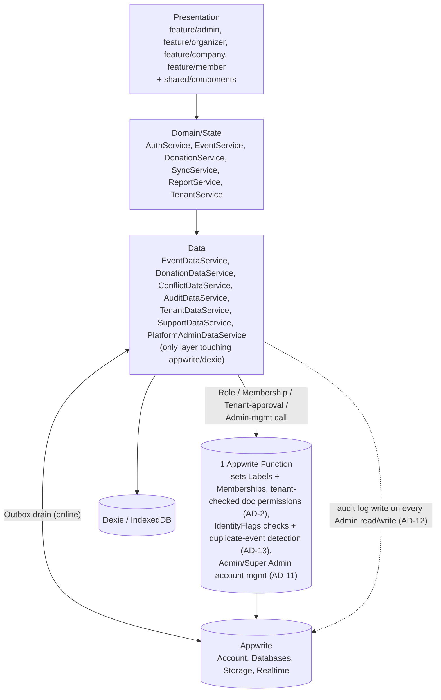
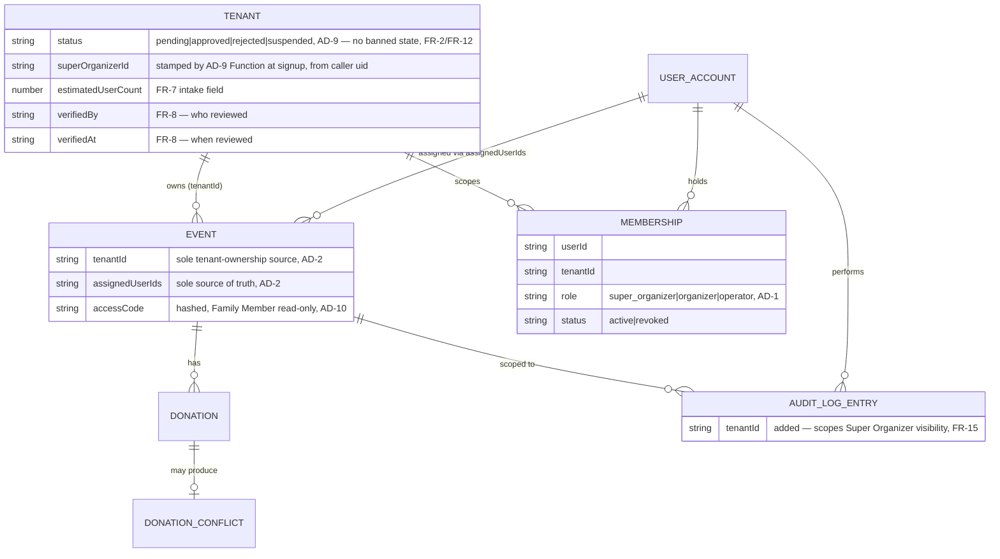

# Architecture Spine — Givio Donation Management System

## Design Paradigm

**Layered architecture** with three layers, an **offline-first Outbox** at the sync boundary, and **permissions mechanically derived from data** (never hand-edited in a second place). The layering itself is unchanged by the multi-tenant extension — only the one Appwrite Function's responsibilities grew (AD-9, amended):

1. **Presentation** — `feature/{admin,organizer,member}` page trees (1:1 with the screen specs in `.claude/skills/plan/`) + `shared/components` UI library.
2. **Domain/State** — signal-based services (`AuthService`, `EventService`, `DonationService`, `SyncService`, `ReportService`, `TenantService`, `SupportService`). Root-provided, no NgRx. (Renamed from an earlier `*Store` suffix convention — mid-Epic-1 decision, see Story 1.4 — since "Store" read as implying Redux/NgRx to readers unfamiliar with the codebase; these are plain injectable Angular services holding signal-based state, nothing more.)
3. **Data** — one data-access class per aggregate (`EventDataService`, `DonationDataService`, `ConflictDataService`, `AuditDataService`, `TenantDataService`, `SupportDataService`, `PlatformAdminDataService`), each the *only* code allowed to import `appwrite` or `dexie`. Each writes Dexie first and queues an **Outbox** entry for remote sync. (Renamed from an earlier `*Repository` suffix — Story 2.1 decision — since the Domain/State layer already reserves `EventService`/`DonationService` for the same entities; `*DataService` disambiguates the two layers without reintroducing a Redux-sounding `*Store`/`*Repository` name. A Data-layer class with no same-named Domain/State counterpart, e.g. `UserService`, `SupportDataService`, `PlatformAdminDataService`, keeps the plain `<Entity>Service`/`<Entity>DataService` name.)



- **Rule:** dependencies flow strictly downward. Presentation never imports `appwrite`/`dexie`; Domain/State never imports them either — both go through the Data layer. The one Appwrite Function is invoked only from `data/services`' Data-layer classes, never from Presentation directly.

## Invariants & Rules

### AD-1 — Global role via Appwrite Labels, narrowed to platform-wide Admin/Super Admin only (AMENDED — was "Admin/Operator")

- **Binds:** auth, all platform-wide permission rules, `AuthService`, AD-9 Function
- **Prevents:** the current `login.ts` pattern (`account.prefs.role`) lets any signed-in user self-escalate via `account.updatePrefs`, since prefs are client-writable. Labels are server/Console-only (verified against current Appwrite docs). Extended by the multi-tenant PRD: representing a *tenant-scoped* role (Super Organizer/Organizer/Operator) as an Appwrite Label — Labels can't be parameterized/wildcarded per tenant in a permission rule, so a composite Label (e.g. `organizer:tenantA`) buys nothing beyond display; representing it via Appwrite Teams instead was also rejected — an invite-by-email Team membership attaches to whichever existing Account matches that email, which would collapse one human working two tenants into a single shared Account, violating FR-4/FR-5's credentials-per-relationship.
- **Rule:** Appwrite **Labels** are now reserved for exactly the two platform-wide roles that are actually global: `admin` and `super_admin` (AD-11). `AuthService` reads `account.labels` for these; permission rules needing a global (not tenant- or event-scoped) check use `Role.label('admin')`. Every tenant-scoped role (Super Organizer, Organizer, Operator) instead lives in a new **Memberships** collection — `{userId, tenantId, role: super_organizer|organizer|operator, status: active|revoked, grantedBy, grantedAt}` — written only by the AD-9 Function, never hand-edited elsewhere. `IUserPrefs.role` remains removed. (Family Members still don't hold accounts at all — see AD-2/AD-10.)

### AD-2 — Event-scoped access derived from `assignedUserIds` + `accessCode`, now tenant-checked (AMENDED — PRD's own data model, not Teams)

- **Binds:** Events, Donations, DonationConflicts, Memberships (AD-1)
- **Prevents:** (a) an operator/family member reading or writing an event they aren't assigned to, even via direct API call (FR-SEC-002); (b) two sources of truth for "who's assigned" — an earlier draft of this spine used Appwrite Teams alongside the PRD's own `assignedUserIds:String[]` field, which would have let one story update Team membership and another update `assignedUserIds` and silently disagree; (c) extended by the multi-tenant PRD: an Event permission being granted to a uid whose Membership belongs to a *different* tenant, or whose Membership is revoked/pending — either would puncture FR-2's structural tenant-isolation guarantee at the one layer (Appwrite document permissions) everything else here is derived from; (d) a **revoked** Membership or a **suspended/rejected** Tenant leaving an already-granted `Role.user(uid)` entry sitting on Events the uid can no longer be trusted on — FR-17/UJ-5's "immediately loses write access" is a live security requirement, not just a future-grant rule.
- **Rule:** `Event` gains a `tenantId` field — the sole source of which tenant owns the Event, set at creation, immutable. `Event.assignedUserIds` (PRD §9.1) remains the *sole* source of truth for *who*, but the AD-9 Function now refuses to add `Role.user(uid)` to an Event's (and its Donations') derived permissions unless `uid` holds an **active** Membership (AD-1) whose `tenantId` matches that Event's own `tenantId` — this is the one place FR-2's structural tenant isolation is mechanically enforced, not left to the UI. `[Role.user(uid) for uid in assignedUserIds if tenant-matched active Membership] + Role.label('admin')` recomputed every time `assignedUserIds` changes, **and also** every time a Membership's `status` changes to `revoked`, or a Tenant's `status` changes to `suspended`/`rejected` — in either case the Function sweeps every Event currently owned by that Membership's tenant (Membership revoke: that one uid's Events; Tenant suspend/reject: every Event owned by that `tenantId`, across every affected uid) and retracts the revoked uid's `Role.user(uid)` grant at that moment, not waiting for a separate `assignedUserIds` edit. No code path ever edits document permissions directly; they are only ever regenerated. Family Member read-only access is still derived from `Event.accessCode` (PRD §9.1, hashed) per AD-10, unaffected. Admin's (and Super Admin's, AD-11) cross-tenant/cross-event visibility still falls out for free: `Role.label('admin')` is always included regardless of assignment or tenant.

### AD-3 — Conflict detection compares `$updatedAt`; conflicts resolved server-side only, Admin-only

- **Binds:** `SyncEngine`, `DonationDataService`
- **Prevents:** two builders inventing different "what counts as a conflict" logic, and a second offline conflict-review UI for a scenario PRD scopes as Admin-only online (PRD §10.2: "Conflict Resolution — Admin only").
- **Rule:** per PRD §8.3 exactly — every outbox *update* entry carries `baseUpdatedAt` (the server `$updatedAt` seen when the local edit began). On push, if the server document's current `$updatedAt` no longer matches `baseUpdatedAt`, it's a conflict: the incoming version is written to a `DonationConflicts` collection (`Role.label('admin')` only, references both versions), the server document is left untouched, and the local record's `syncStatus` is set to `'conflict'` (reusing the enum PRD §9.1 already defines). The shared `sync-status` screen's conflict-resolution section renders only when `Role.label('admin')` is present; other viewers of that screen see pending/synced counts only, never conflict diffs.

### AD-4 — Offline writes go through a per-entity Dexie Outbox with client-generated IDs

- **Binds:** `DonationDataService`, `EventDataService`, `SyncEngine`
- **Prevents:** divergent "when do we talk to Appwrite" logic per screen; duplicate documents from retried creates; one slow/stuck entity blocking every other entity's sync.
- **Rule:** every mutation writes to its local Dexie table **and** appends an outbox entry: `{ id, entityType: 'event'|'donation', entityId, op: 'create'|'update'|'delete', payload, baseUpdatedAt (update ops only), status: 'pending'|'synced'|'conflict'|'failed', retries, createdAt }`. `entityId` for a `create` is generated client-side via `ID.unique()` at the moment of creation (no network needed), so retrying a `create` is an idempotent upsert-by-id, never a duplicate. `SyncEngine` (root service) drains the outbox **per-entity FIFO** — each entity's own mutations apply in order, but entity A's queue never blocks entity B's. Donation entry/edit/receipt generation must work fully offline (FR-OFF-002).

### AD-5 — Money is integer minor units

- **Binds:** Donation entity, reporting/export
- **Prevents:** float rounding drift between displayed and stored totals.
- **Rule:** amounts are stored and transmitted as integer pesewas (GHS × 100), never floats. Display formatting divides by 100 at the presentation edge only. (PRD §9.1 lists `amount: Number` without specifying units — this pins it.)

### AD-6 — Route guards are functional and assignment-scoped

- **Binds:** `app.routes.ts` and every lazy-loaded child route config
- **Prevents:** the current state — zero guards; role redirect happens only imperatively inside `login.ts`, so any authenticated user can navigate directly to `/admin-dashboard`; PRD acceptance criterion #16 ("unassigned operator denied even via direct URL") is currently unmet.
- **Rule:** `CanActivateFn` guards check `AuthService`'s label-derived role for role-gated routes, and additionally check the target event's `assignedUserIds` (or valid `accessCode` session, for Family Members) against the caller for event-scoped routes — the same data AD-2's permissions are derived from, so the guard and the Appwrite-level enforcement can never disagree.

### AD-7 — Feature routes are lazy-loaded

- **Binds:** `app.routes.ts`
- **Prevents:** the current flat, fully-eager route table from growing to 26+ eager components.
- **Rule:** each role tree (`admin`, `organizer`, `member`) is a `loadChildren`/`loadComponent` boundary. (Already a standing house rule in `.instructions.md` — applying it here, not re-deciding it.)

### AD-8 — Receipt numbers are provisional-then-final

- **Binds:** Donation entity, receipt PDF generation, reporting/export
- **Prevents:** two concurrently-offline operators on the same event colliding on PRD's required "auto-generated sequential per event" receipt number (FR §9.1) — no client can safely claim a true sequential number without a network round-trip.
- **Rule:** offline, the client assigns a provisional local number (event short code + "-P" + a local sequence number, e.g. `WED42-P7`), shown on the printed/PDF receipt with a small "provisional" marker. On successful sync, the server assigns the canonical number via an atomic `nextReceiptSeq` counter field on the Event document, and the donation's `receiptNumber` is updated to that value — nothing already handed to a donor needs reprinting, only the stored/reported number changes. *(User-confirmed.)*

### AD-9 — One Appwrite Function is the sole writer of Labels, Memberships, and derived permissions (AMENDED — scope grown)

- **Binds:** `data/services`, admin-settings "Change Role"/"Assign Operators" actions, Organizer self-signup & approval, co-Organizer/Operator addition, Admin/Super Admin account management (AD-11)
- **Prevents:** AD-1 requiring server-only Label writes and AD-2 requiring bulk permission rewrites, while the rest of the architecture is pure-client with no backend of its own — without this, those two ADs would be unimplementable. Extended by the multi-tenant PRD: a Membership grant, a Tenant creation/approval-state change, or an Admin/Super Admin account-management action being writable from anywhere but this one trusted Function — any of those would let a client bypass AD-1's Label/Membership guarantee, AD-2's tenant-match check, or AD-11's `super_admin`-only gate; a Membership revoke or Tenant suspend/reject that changes state but never triggers AD-2's permission-sweep, leaving a fired Operator's or suspended Organizer's Event access live (FR-17/UJ-5); and an `organizer`-role caller granting another Organizer-level Membership, which FR-11 reserves to `super_organizer` alone.
- **Rule:** a single Appwrite Function is now the only code that ever sets a user Label, creates a Tenant document or writes/revokes a Membership record (AD-1), rewrites an Event/Donation document's derived permissions including the tenant-match check and the revoke/suspend sweep (AD-2), transitions a Tenant's approval state (`pending`→`approved`/`rejected`/`suspended` — see the Tenant-status note below), or manages an Admin/Super Admin account (AD-11). It's invoked by the Data layer (`data/services`, never directly from Presentation) for: an Admin changing a user's role or editing `assignedUserIds`/`accessCode` (original scope); Tenant creation itself — the initial `pending`-status row written at self-signup, not just the later approval transition, with `superOrganizerId` stamped from the authenticated caller's own uid at that moment, never client-written; Organizer self-signup approval and co-Organizer/Operator addition, where it also cross-references the IdentityFlags list (FR-12/FR-23) before granting a Membership, and rejects the call outright if the caller's own Membership role is `organizer` rather than `super_organizer` (FR-11 — only a Super Organizer may add another Organizer-level Membership); and Admin/Super Admin account create/promote/demote/suspend (AD-11). It also runs duplicate-event detection (AD-13) on Event creation, since that check needs the same elevated, cross-tenant-visible trust boundary. The Function's now-many concerns are organized as separate per-concern source files within the one deployed Function — extending the existing convention already in `functions/set-role-and-permissions/src/` (`admin-users.js`, `event-assignment.js`, `conflict-resolution.js`, `donation-recording.js`, `family-access.js`, `shared.js`, routed through `main.js`) with new files for the grown scope (e.g. a Tenant/Membership file, an IdentityFlags/duplicate-event file) — never one monolithic handler. Revocation reads `Membership.status` (not Appwrite's native account state) as the fast, queryable source of truth AD-2's permission derivation depends on; the Function separately invokes Appwrite's native account-block (`users.updateStatus`) in parallel, as defense-in-depth that blocks login/session itself, but no permission-derivation logic ever depends on that native state. Memberships/Tenant/IdentityFlags collections carry no client write permission at all — see the Consistency Conventions table. *(The original scope was a real, small addition beyond the PRD's v1.0 architecture section, which named an Appwrite Function only as an optional v1.1 item for Excel export; the multi-tenant PRD's Integration & Dependencies §11 explicitly extends this same Function rather than introducing a second one.)*

### AD-10 — v1 share access is the PRD baseline only

- **Binds:** Family Member access, `share-access.md` scope
- **Prevents:** building two competing no-login-access mechanisms at once.
- **Rule:** v1 ships exactly PRD FR-AUTH-004 — one hashed, read-only `accessCode` per event for Family Members (AD-2). The richer `share-access.md` screen (tiered view/add/full, revocable, expiring, multi-link delegation for helpers with no account) is explicitly **Deferred** to v1.1+, since granting *write* access with no account needs its own signed-token + Function-verification mechanism, not just a read-only code. *(User-confirmed.)*

### AD-11 — Super Admin is dual-Labeled, not a separate account tier

- **Binds:** `AuthService`, Admin-account-management actions, AD-9 Function
- **Prevents:** two builders picking incompatible representations for "the one account that can manage Admins" — e.g. a `role` enum column on the user record vs. a third Label — while every existing `Role.label('admin')` check (AD-2, AD-9, AD-12) must keep including Super Admin for free, and admin-account management itself must gate to Super Admin alone with zero exceptions (FR-26).
- **Rule:** exactly one Appwrite Account holds **both** the `admin` and a new `super_admin` Label at any time — bootstrapped directly at deploy time (Appwrite console/seed script), never via an in-app flow, since there's no prior Super Admin to grant it. Every existing `Role.label('admin')` check continues to include Super Admin unchanged. Create/promote/demote/suspend of an Admin account is gated exclusively on `Role.label('super_admin')`, enforced inside the AD-9 Function (never a client-side-only check). Succession (moving `super_admin` to a different Account) is **Deferred** — manual/out-of-band, not v1 in-app scope (PRD §4.8/FR-26). *(User-confirmed.)*

### AD-12 — Admin/Super Admin access logging is client-side, at query granularity

- **Binds:** `EventDataService`, `DonationDataService`, `AuditDataService`
- **Prevents:** two builders diverging on how FR-19's "every Admin access is logged" gets built — one Function-proxying every Admin read (tamper-proof, but adds a backend surface that breaks the pure-client Data-layer paradigm every other AD here assumes) vs. a client-side log write (matches the existing `AuditDataService` create/edit/delete pattern, but only best-effort) — picking the wrong one either introduces an unplanned architectural shift or silently produces a spoofable log without anyone having decided that trade-off on purpose.
- **Rule:** `EventDataService`/`DonationDataService` fire an audit-log write (via `AuditDataService`, extending the existing create/edit/delete pattern) whenever the caller holds `Role.label('admin')` (includes Super Admin, AD-11), at query granularity — pinned explicitly as **one log entry per Data-layer method invocation**, never coalesced at the Domain/State or Presentation layer: one `EventDataService.listEvents()` call is one log entry, even when a single screen load triggers several such calls (e.g. an Admin dashboard load that calls both `EventDataService.list()` and `DonationDataService.list()` produces two entries, not one). Not per row. Best-effort/accountability trail, not tamper-proof: Admin already has unrestricted read access today via AD-2's "`Role.label('admin')` always included" rule; this logs that access, it doesn't gate it. A Function-proxied read path was explicitly rejected as disproportionate for v1, since the platform's threat model is Organizer-on-family fraud, not Admin-on-tenant. *(User-confirmed.)*

### AD-13 — Duplicate-event detection runs only at Admin's platform-wide layer, and never blocks

- **Binds:** Event creation path (`EventDataService`), Admin review queue, AD-9 Function
- **Prevents:** a tenant-scoped Organizer flow running its own duplicate-event check (the only way to compare across tenants would require reading another tenant's Event data, puncturing AD-2/FR-2's structural isolation) and a check that blocks Event creation outright (a false positive would block a legitimate rescheduled/re-created event — PRD's SM-C2 counter-metric).
- **Rule:** the duplicate-event comparison (FR-14) executes only inside the AD-9 Function — the one place that already holds cross-tenant-visible trust (same boundary as AD-12's Admin logging) — never a tenant-scoped role or client-side code. A match writes a row to a dedicated `DuplicateEventFlags` collection (`{id, eventId, matchedEventId(s), flaggedAt, reviewedBy, reviewedAt}`, `Role.label('admin')`-only, mirroring AD-3's `DonationConflicts` precedent) — never an unnamed field on `Event` itself — and surfaces as a flag in Admin's review queue; Event creation itself is never blocked by a flag. Exact matching algorithm (which fields, fuzzy vs. exact match): **Deferred**.

## Consistency Conventions

| Concern | Convention |
| --- | --- |
| Naming (entities, files, interfaces, events) | Entities follow PRD §9.1 exactly: `Event`, `Donation`, `DonationConflict`, `AuditLogEntry` (PascalCase, singular), extended by the multi-tenant PRD's `Tenant`, `Membership`, `IdentityFlag`, `SupportRequest`. Signal-based Domain/State holders: `<Entity>Service` (e.g. `AuthService`, `EventService`, `TenantService`) — not `<Entity>Store`, to avoid implying Redux/NgRx (renamed mid-Epic-1, see Story 1.4). Data-layer classes (touch `appwrite`/`dexie` directly): `<Entity>DataService` when a same-named Domain/State service exists (e.g. `EventDataService` alongside `EventService`, `TenantDataService` alongside `TenantService`), or plain `<Entity>Service`/`<Entity>DataService` when it doesn't (e.g. `UserService`, `SupportDataService`, `PlatformAdminDataService`, none of which have a Domain/State counterpart) — not `<Entity>Repository` (renamed Story 2.1, same Redux-adjacent-naming reasoning as the `*Store` rename). IDs are Appwrite `$id` strings, client-generated via `ID.unique()` for offline creates (AD-4) — never a separate numeric id. |
| Data & formats (ids, dates, error shapes, envelopes) | Dates: ISO 8601 strings (never a bare `Date` — `.instructions.md` already forbids assuming `new Date()` globals). Money: integer minor units (AD-5). Deletes are soft (`isDeleted`/`deletedAt`/`deletedBy` per PRD §9.1) — never a hard Appwrite document delete; extended by FR-13/FR-26 to accounts: no Organizer/Operator/Admin account that has ever recorded a donation or taken an approval action is ever hard-deleted, only revoked/suspended (`status` field, AD-1/AD-11). Errors: Data-layer classes translate `AppwriteException` into a domain-level `ServiceError` (renamed from `RepositoryError`, Story 2.1, alongside the `*Repository`→`*DataService` naming change) before it reaches Domain/State — Presentation never sees an Appwrite-shaped error. |
| State & cross-cutting (mutation, errors, logging, config, auth) | Signals only, no NgRx (house convention, already established). `.update()`/`.set()`, never `.mutate()`. All cross-cutting auth/session state lives in `AuthService` (renamed from the original `AuthStore`, which itself had replaced the empty `Authservice` stub). `inject()` over constructor injection; `providedIn: 'root'` for all Domain/State services and repositories. Session persistence relies on the Appwrite SDK's own cookie-based session handling (FR-AUTH-002's "not in localStorage in plain text") — no hand-rolled token storage. |
| Multi-tenant collections (new) | `Tenant` — `{id, name, location, size, type, estimatedUserCount, status: pending\|approved\|rejected\|suspended, superOrganizerId, verifiedBy, verifiedAt, createdAt}` — `estimatedUserCount` is FR-7's fifth intake field (previously dropped from the schema); `verifiedBy`/`verifiedAt` record who reviewed the intake/document/phone-verification and when (FR-8) — a boolean `status: approved` alone doesn't satisfy FR-8's "who, when" requirement. `status` has no `banned` value — the PRD only bans individual identities via `IdentityFlags` (below), never a whole tenant; a Tenant's only lifecycle states are signup-pending, Admin-approved/rejected, and Admin-suspended. Document creation and every transition written only by the AD-9 Function (AD-9). `Membership` — `{userId, tenantId, role: super_organizer\|organizer\|operator, status: active\|revoked, grantedBy, grantedAt}`, the sole source of tenant-scoped role (AD-1), tenant-match-checked before any Event permission grant (AD-2). `IdentityFlag` — cross-signup/addition bypass list (FR-12/FR-23/FR-24), written only by the AD-9 Function; one canonical shape — `{id, name, email, phone, nationalId, flagType: signup_rejected\|duplicate_identity, tenantId, reason, flaggedBy, flaggedAt}` — regardless of which internal Function trigger writes it (signup rejection vs. duplicate-identity-on-addition are the same write path, same shape, never a trigger-specific subset of fields); exact matched fields (which of name/email/phone/nationalId drive a match) **Deferred**. `DuplicateEventFlags` — AD-13's duplicate-event match, dedicated collection mirroring `DonationConflicts` (AD-3), not an unnamed field on `Event`. `SupportRequest` — `{id, submissionType: question|suspension_dispute, tenantId?, userId?, submitterEmail?, submitterTenantName?, message, createdAt, status}` — Contact Admin form submissions (FR-20). The authenticated path (`question`) sets `tenantId`/`userId` from the session; the unauthenticated dispute path (`suspension_dispute`, added 2026-09-25 — a suspended tenant's people can't authenticate to reach the ordinary form) sets `submitterEmail`/`submitterTenantName` instead, since there's no session to derive `tenantId` from. Creatable by `Role.any()` for the dispute path specifically (the one deliberate unauthenticated write in this schema, alongside AD-10's existing `resolveAccessCode`); every other field/path stays Admin-only read, Function-or-session-write. `audit_logs` gains a `tenantId` column so Super Organizer visibility can filter to their own tenant while Admin's stays platform-wide (FR-15). A verification-document Storage bucket holds Organizer onboarding uploads (FR-8, business-registration/ID), Admin/Super Admin-readable only. **Write permissions:** `Tenant`, `Membership`, and `IdentityFlag` collections carry no client-side create/update/delete permission at all (Appwrite collection-level write roles left empty — API-key/Function-only), making "sole source of truth" structural, not conventional. **Read permissions:** `Tenant` — `Role.label('admin')` (platform-wide) plus any uid holding an active Membership in that tenant (so Organizer/Operator UI can render their own tenant's name/status); `Membership` — `Role.label('admin')` plus the row's own `userId` (a user can read their own role/status, never another member's row); `IdentityFlag` — `Role.label('admin')` only, never client-readable by any tenant-scoped role (cross-tenant PII). |

## Stack

| Name | Version |
| --- | --- |
| Angular | ^22.1.7 (verified against `package.json`; current — matches npm's latest `@angular/core` release as of 2026-09-23) |
| Appwrite (web SDK) | ^27.0.0 (verified against `package.json`; current — matches npm's latest `appwrite` release as of 2026-09-23; confirm compatibility with the provisioned Appwrite Cloud instance before the auth/data epics start) |
| Dexie | ^4.4.6 (verified against `package.json`; current as of 2026-09-23) |
| Angular Material | ^22.1.7 (verified against `package.json`; current as of 2026-09-23 — icons/badge/tooltip only) |
| PrimeNG | ^22.1.1 (verified against `package.json`; current as of 2026-09-23 — actively used, not just installed: see the recent "wire up PrimeNG license key config" commit; was previously missing from this table entirely) |
| jsPDF | 4.2.1 — install normally via `npm install jspdf` (verified current) |
| SheetJS (`xlsx`) | Do **not** `npm install xlsx` — the npm-registry package is stale and in the CVE-2024-22363 vulnerable range; SheetJS stopped publishing there. Vendor the official tarball from `cdn.sheetjs.com` per their current install docs. |
| Appwrite Functions | 1 function (AD-9, scope grown — see AD-1/AD-2/AD-11/AD-12/AD-13) — runtime/language choice left to the epic that builds it. |

## Structural Seed

```text
src/
  app/
    auth/                  # existing: login page + auth model (Authservice stub -> replaced by data/services/AuthService)
    data/                  # NEW — the only layer touching appwrite/dexie
      appwrite/            # client.ts (Account, Databases, Storage) reads src/environments, replaces src/lib/appwrite.ts
      dexie/                # AppDb (Dexie subclass): events, donations, outbox tables
      services/             # Domain/State: AuthService (session state now extended with the Family personal-device
                            #   prompt/auto-logout state, FR-16, on top of the existing accessCode session), EventService,
                            #   DonationService, SyncService, TenantService, SupportService (signal-based; folder
                            #   renamed from stores/ — see Story 1.4) + Data:
                            #   UserService, EventDataService, DonationDataService, ConflictDataService,
                            #   AuditDataService, TenantDataService (Tenants + Memberships + verification-doc
                            #   Storage bucket), SupportDataService (SupportRequests), PlatformAdminDataService
                            #   (Admin/Super Admin account mgmt, AD-11) — the only files touching appwrite/dexie
      sync/                 # SyncEngine (per-entity outbox drain), NetworkStatusService
    feature/
      admin/                # renamed/expanded from current admin tree — admin-* screens + NEW: Organizer approval
                            #   queue (FR-6/7/8/9), duplicate-event review (AD-13), Super Admin-only Admin-account
                            #   management view (AD-11, route-guarded on Role.label('super_admin'))
      organizer/            # UNCHANGED from v1 — renamed from the original 'user' tree in Epic 1, houses the
                            #   Operator-tier screens (organizer-*, add-donation, edit-donation, event-detail) plus
                            #   the event-switcher (FR-3). Left untouched by this capability on purpose — see the
                            #   `company/` tree below for why the new Organizer/Super Organizer role does NOT also
                            #   live here, despite the name collision that might suggest otherwise.
      company/              # NEW tree, new route segment `/company` — the tenant-leadership tier (Organizer/Super
                            #   Organizer, PRD's naming): self-signup (FR-6), co-Organizer/Operator management,
                            #   consolidated cross-event dashboard (FR-21), tenant-scoped audit log (FR-15), Contact
                            #   Admin form (FR-20). Deliberately a new route rather than reusing `/organizer` —
                            #   that path is already the Operator tier's stable, in-production URL; renaming it to
                            #   free the name up was considered and rejected as unnecessary regression risk for a
                            #   naming-purity gain (2026-09-25 elicitation).
      member/               # NEW tree — member-* screen specs (does not exist yet)
      components/           # existing: sidebar, stat-card, recent-activity, quick-actions, system-health
    shared/
      components/           # existing button/input/card/... library
  environments/             # existing — becomes the single source of Appwrite endpoint/project (fixes hardcode)
functions/
  set-role-and-permissions/ # the one Appwrite Function from AD-9 — scope grown to Memberships/Tenant approval/
                            #   Admin mgmt/IdentityFlags/duplicate-event detection (AD-1, AD-2, AD-11, AD-12, AD-13),
                            #   organized as one source file per concern (AD-9): existing admin-users.js,
                            #   event-assignment.js, conflict-resolution.js, donation-recording.js, family-access.js
                            #   (also handles FR-16's Organizer-triggered accessCode invalidation/reissue, reusing
                            #   its existing generateAccessCode action), shared.js, routed through main.js — plus
                            #   new per-concern files for Tenant/Membership and IdentityFlags/duplicate-event
```



## Capability → Architecture Map

| Capability / Area | Lives in | Governed by |
| --- | --- | --- |
| Login, session, role (`login-screen`) | `auth/` + `data/services/AuthService` | AD-1, AD-6 |
| Admin dashboard/donations/events/reports (`admin-*`) | `feature/admin/` | AD-2, AD-6, AD-7, AD-12 |
| Admin settings — Change Role / Assign Operators (`admin-settings`) | `feature/admin/` calling `data/services` -> AD-9 Function | AD-1, AD-2, AD-9 |
| Organizer onboarding & approval (self-signup, intake, verification, approval queue, duplicate-event review) | `feature/company/` (self-signup) + `feature/admin/` (approval/review queue) + `data/services/TenantDataService` -> AD-9 Function | AD-1, AD-9, AD-13 |
| Tenant / Membership management (add/revoke co-Organizer, Operator; consolidated dashboard; tenant-scoped audit log) | `feature/company/` + `data/services/TenantDataService` -> AD-9 Function | AD-1, AD-2, AD-6, AD-9 |
| Operator event-switcher (FR-3, multi-Event within one tenant) | `feature/organizer/` (unchanged tree) | AD-2, AD-6 |
| Super Admin account management (create/promote/demote/suspend Admin) | `feature/admin/` (Super Admin-only) calling `data/services/PlatformAdminDataService` -> AD-9 Function | AD-11, AD-9 |
| Organizer dashboard/donations/events/reports (`organizer-*`, `add-donation`, `edit-donation`, `create-event-screen`, `edit-event`, `event-detail`) — unchanged v1 Operator-tier surface | `feature/organizer/` | AD-2, AD-3, AD-4, AD-6, AD-7, AD-8 |
| Member dashboard/donations/events (`member-*`) | `feature/member/` | AD-2, AD-10, AD-6, AD-7 |
| Family personal-device prompt/auto-logout + Organizer-triggered accessCode invalidation/reissue (FR-16) | `feature/member/` + `data/services/AuthService` (session state) for the prompt/auto-logout; `feature/company/` -> AD-9 Function's `family-access.js` (`generateAccessCode` reused) for reissue | AD-9, AD-10 |
| Donor verification, donation list, export preview (`donor-verify`, `donation-list`, `export-preview`) | `feature/{admin,organizer}/` + `data/services` | AD-2, AD-5 |
| Share access (`share-access`) | v1: not built (AD-10) — Deferred to v1.1+ | AD-10 |
| Reports/exports (`reports`, `event-reports`, `organizer.report`, `admin-report`, consolidated cross-event total) | `data/services/ReportService`, `TenantDataService` (client-side generation) | AD-5, Stack (jsPDF/SheetJS) |
| Offline sync status (`sync-status`) | `data/sync/SyncEngine`, `data/services/SyncService` | AD-3, AD-4 |

## Deferred

- **Realtime updates** (PRD §8.2 commits to Appwrite Realtime subscriptions per-event donations collection for live dashboard/family totals): the subscription wiring itself is a Domain/State concern left to the epic that builds `EventService`/`DonationService` — this spine's layering is unaffected either way since Presentation only ever talks to the service.
- **`share-access.md`'s full tiered/revocable delegation scheme** — deferred to v1.1+ per AD-10.
- **Deployment & environments** (hosting for the Angular PWA, Appwrite Cloud env promotion, CI/CD): out of scope for this spine.
- **Audit log write path mechanism** (data-layer auto-write on every mutation vs. an explicit call per action): FR-SEC-004 only fixes that it must be immutable and complete, not the mechanism — left to the epic that builds `AuditDataService`.
- **Appwrite Function runtime/language** for AD-9: left to the epic that builds it.
- **Duplicate-event detection's exact matching algorithm** (AD-13/FR-14): which fields, fuzzy vs. exact match — left to the epic that builds it.
- **Super Admin succession mechanism** (AD-11/FR-26): moving `super_admin` to a different Account is manual/out-of-band in v1, no in-app flow specified.
- **Exact IdentityFlags matching fields** (FR-23): name/email/phone/national ID and what counts as a flaggable match vs. a coincidental near-match — not yet specified (PRD Open Question 6).
- **Migration/rollout mechanics**: existing test Admin/Event/Donation data is cleared/reset (no real tenant data exists — PRD §12) and the new tenant-model code paths (Memberships, tenant-scoped permissions) stay behind a feature flag until that reset is confirmed complete. Operational sequencing for the epic/deploy runbook, not a spine invariant — there's no reconciliation logic for two builders to diverge on.
- **Operations for the AD-9 Function**: monitoring/alerting for Function errors, failed permission sweeps (AD-2's revoke/suspend cascade), and Function downtime — now a single point of failure for every role/tenant/admin transition in the system, not just role writes — plus backup/restore for Appwrite collections. Named explicitly here as Deferred, not resolved in this pass — left to the deploy runbook.
